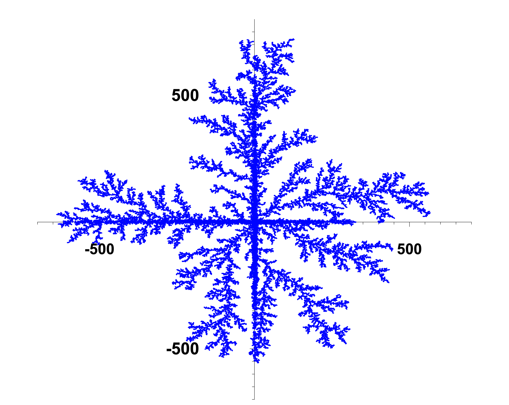

# Particle_Fractal_Simulator
A particle fractal simulator based on a classical physic problem.
## Simple result:
The below figure shows the data collection on file '.txt', using the column 1&2 being (x,y).

